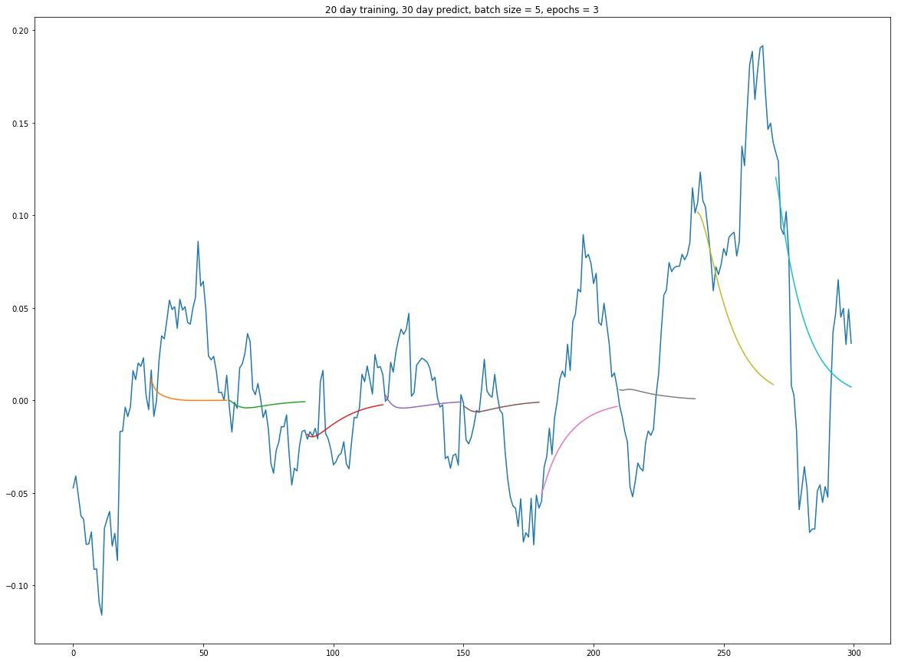
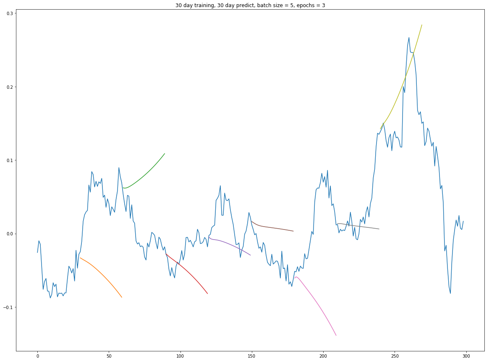
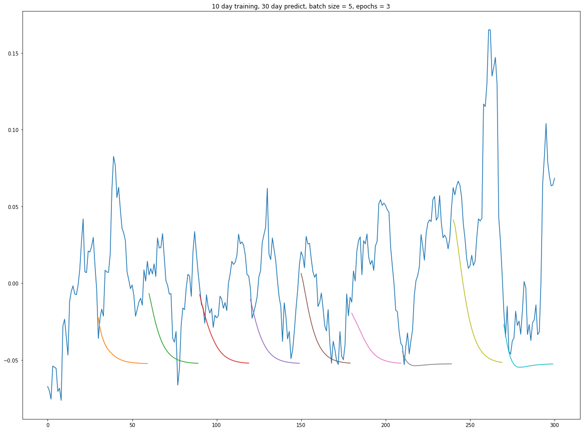

#### Architecture

#### Model Selection
|Params|RMSE for the 30th predicted day|
|----|----|
|10 day training, 30 day predict, batch size = 5, epochs = 3|0.0036|
|15 day training, 30 day predict, batch size = 5, epochs = 3|0.0061|
|20 day training, 30 day predict, batch size = 5, epochs = 3| 0.0029|
|30 day training, 30 day predict, batch size = 5, epochs = 3| 0.1344|
|40 day training, 30 day predict, batch size = 5, epochs = 3| 0.1904|

#### Best Model

#### Other Models

#### Our Trading Strategy:
If the stock is predicted to go **up** after 30 days, we **buy**.
After the 30 days we **sell**.

If the stock is predicted to go **down** after 30 days, we **short** the stock.
After the 30 days we **buy** it back.

#### After 9 iterations of our strategy, do we make money?
|simulation number| Growth per share| Dollars per share|
|--|--| ---|
|1|0.103| 2.6|
|2|-0.103| -2.6|
|3|0.103| 2.6|
|4|0.103| 2.6|
