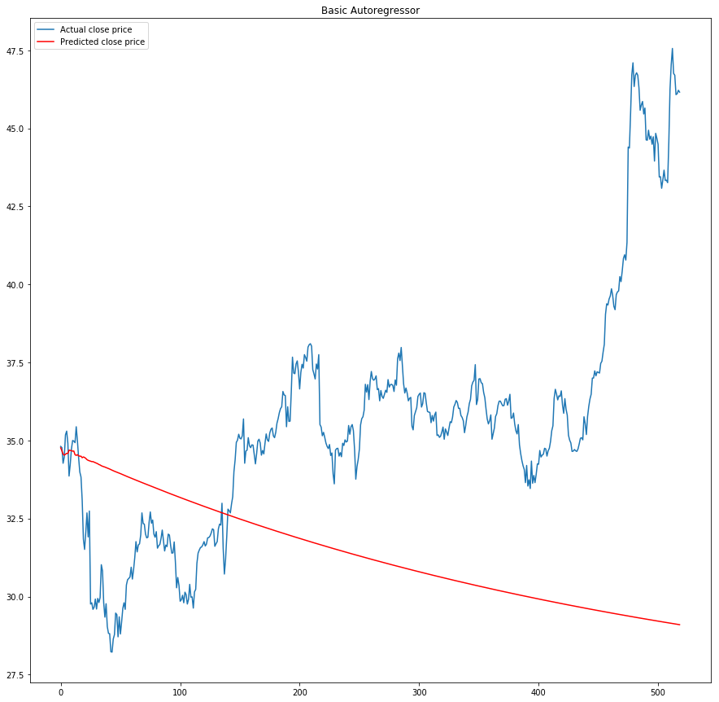

## Predicting Intel Stocks

# Intel Stock Price Prediction

## Time Series Analysis

* EDA
* Linear Regression
* LSTM

### EDA

Our initial dataset consisted of the 30 Dow Jones Industrial Average stocks. We decided to choose only one stock, INTC, in order to produce a working model within the time allotted.

* Train window : 90 days
* Prediction window : 10 days

#### Base Model

#### LSTM Architecture

#### Model Selection

|Params|RMSE for the 30th predicted day|
|----|----|
|10 day training, 30 day predict, batch size = 5, epochs = 3|0.0036|
|15 day training, 30 day predict, batch size = 5, epochs = 3|0.0061|
|20 day training, 30 day predict, batch size = 5, epochs = 3| 0.0029|
|30 day training, 30 day predict, batch size = 5, epochs = 3| 0.1344|
|40 day training, 30 day predict, batch size = 5, epochs = 3| 0.1904|

#### Best Model

#### Other Models

#### Our Trading Strategy:
If the stock is predicted to go **up** after 30 days, we **buy**.
After the 30 days we **sell**.

If the stock is predicted to go **down** after 30 days, we **short** the stock.
After the 30 days we **buy** it back.

#### After 9 iterations of our strategy, do we make money?
| Growth per share| Dollars per share|
|--| ---|
|0.103| 2.6|

#### Buy and Hold Strategy

26.02% Growth over 
